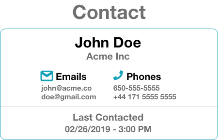
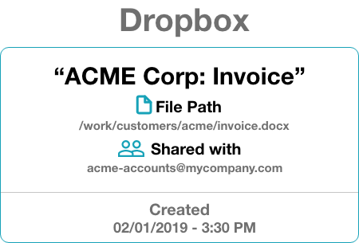
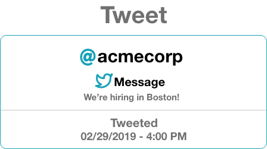

# ACME Search

<h2 style="text-align: center !important;"> 
    Neeva Assessment
</h2>

 

 

## Running the project

There are two ways in which this project can be viewed. The first is simply to click this link [https://neeva-acme-search.herokuapp.com](https://neeva-acme-search.herokuapp.com) which takes you to the deployed version of this project (Please keep in mind that you may experience a lag before the app loads since it is being run on the free dynos). The second way is to run it locally.

### Running it locally

**Steps**

1. If you are not in the directory that contains this project's `package.json` file please, from your terminal, `cd` into it.

    * `cd /path/to/acme_search`

2. From this project's directory install all of the dependencies decleared in the `package.json` file by running `npm install`.

3. After the installation is complete you can simply run `npm start` which will launch the ACME Search app on your default browser.

    * NOTE: Please be sure that you are not running any other programs on port **3000** prior to running `npm start`.

4. If you'd like to run the tests written for this app you may open up a new terminal tab or terminate our running app and from the same terminal tab run `npm test`.

 

 

## Project Design

### Directory structure

* `./src` contains all `.js` files developed for this project.

* `./src/assets` contains all the icons used.

* `./src/components` contains all react components.

    * NOTE: Each component has its own directory which contains all relevant files for that component including `*.test.js` files and `__snapshots__` if applicable.

* `./src/constants` contains all constant values used.

* `./src/data` contains the `.json` files provided.

* `./src/services` contains the services which are in charge of handeling the business logic.

    * NOTE: Data is currently read from static `.json` files but the services can be easily modified to read the data from a database or some external microservice.

* `./src/utils` contains utility functionality (eg. analytics utility) which is shared across various parts of this project.

### Design decisions

Below I'll talk about some of the design decision I made pertaining to both software and UI/UX.

#### Software

I had to make few technological decision when developing this project. The main one was choosing the frontend library that this project was built on. I chose React not only because it is heavily used at Neeva but also because it makes componentizing our views/logic incredibly simple which translates into greater reusability of our code and faster development time.

When it comes decisions regarding the software I developed, I chose to implement the separation of concerns design pattern. I separated the presentation layer from the business logic layer. This separation can be seen by looking at the directory structure where I have the `services` handling the business logic while the `components` handles presentation logic. As stated before, the `data` directory holds our static `.json` files which currently serve as our resourse access layer that our `services` interact. However, the resource access layer can be easily swapped within our `services` by making a few modifications to the parent service constructor.

#### UI/UX

Keeping ease of use in mind I decided to avoid creating routes within this application and just displayed all of the information that is relevant to the user in one place. I took into account the fact that there could be many search results after a query so I implemented some navigational assistance, such as buttons that take the user to the results seciont of their interest and a button to take them back to the search bar. The information is displayed in cards. These cards contain a title, a body with all of the relevant information, and a footer which displays chronological information. Icons are used along with subtitles within the body to help visual user better understand the contents of what they're looking at. These informational cards have a consistent UI so as to not confused users.

Below I've included some of my original card designs for each search category. Designs were created with the AdobeXD software.

